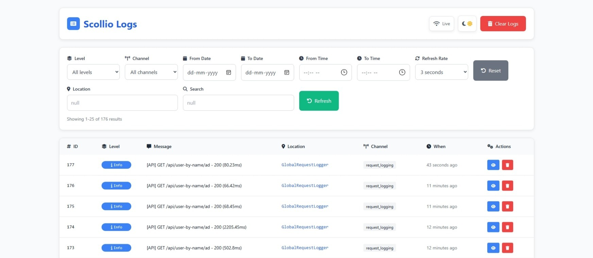
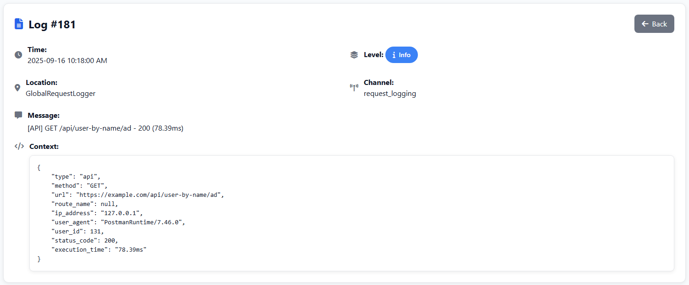

# Scollio Logger

**Scollio Logger** is a modern, database-backed logging package for Laravel (8.x, 9.x, 10.x, 11.x) with a built-in dashboard for managing and filtering logs.
It is PSR-3 compliant and supports all standard log levels.

***

## Features

- 📦 Database-backed logging
- 🎨 Modern responsive dashboard (light \& dark theme support)
- ✅ PSR-3 compliant (`emergency`, `alert`, `critical`, `error`, `warning`, `notice`, `info`, `debug`)
- 🛠 Configurable middleware, routes, and retention policies
- 🔍 Dashboard filters (level, date range, channel, location, etc.)
- 🚀 Works with Laravel 8 → 12 (version-agnostic, tested up through Laravel 12)

***

## Installation

```bash
composer require kz370/scollio-logger
```


***

## Publish Config, Migrations, and Views

```bash
php artisan vendor:publish --tag=scollio-logger-config
php artisan vendor:publish --tag=scollio-logger-migrations
```

Run the migration:

```bash
php artisan migrate
```


***

## Configuration with Environment Variables

You can customize important settings using `.env` variables:

```env
# Enable or disable the logger globally (true or false)
SCOLLIO_LOGGER_ENABLED=true

# Enable or disable the dashboard feature (true or false)
SCOLLIO_LOGGER_DASHBOARD_ENABLED=true

# Route path for the dashboard
SCOLLIO_LOGGER_DASHBOARD_ROUTE=scollio-logs/dashboard

# Number of logs per page in dashboard pagination
SCOLLIO_LOGGER_DASHBOARD_PAGINATION=25

# Number of days to retain logs
SCOLLIO_LOGGER_RETENTION_DAYS=10 
```


***

## Usage

You can use the logger via the **facade** or **service container**:

```php
// Using facade
ScollioLogger::error('Payment failed', 'OrderController::processPayment', ['order_id' => 123]);

// Using container
app('scollio-logger')->info('User logged in', 'AuthController::login', ['user_id' => 5]);
```


***

## Dashboard

After installation, access the dashboard at:

```
/scollio-logs/dashboard
```

You can configure the route prefix and middleware in `config/scollio-logger.php`.

***

## Global Request Logging

Scollio Logger can automatically log all HTTP requests to your application.

### Enable Request Logging

Add these environment variables to your `.env` file:

SCOLLIO_REQUEST_LOGGING_ENABLED=true
SCOLLIO_REQUEST_LOGGING_API=true
SCOLLIO_REQUEST_LOGGING_WEB=true


### Configuration Options

- `SCOLLIO_REQUEST_LOGGING_ENABLED`: Enable/disable request logging
- `SCOLLIO_REQUEST_LOGGING_API`: Log API requests (requests to `/api/*` or JSON requests)
- `SCOLLIO_REQUEST_LOGGING_WEB`: Log web requests
- `SCOLLIO_REQUEST_LOGGING_PAYLOAD`: Include request payload in logs (excluding sensitive data)
- `SCOLLIO_REQUEST_LOGGING_HEADERS`: Include request headers in logs

After enabling, clear your config cache:

php artisan config:clear

text

All requests will now be automatically logged and viewable in the Scollio Logs dashboard.

***

## Seeder (Testing Only)

For demo/testing purposes, this package includes a **seeder** that generates 100 random log entries.

Run it with:

```bash
php artisan db:seed --class=ScollioLoggerSeeder
```

⚠️ This is **only for testing/demo** and should **not** be used in production.

***

## Screenshots


***


Example features shown:

* Dashboard main view with log table
* Light and dark theme support
* Filtering logs by level, channel, date range
* Single log detail view with context
* Responsive design and modern UI

***

## License

This package is open-source software licensed under the [MIT license](LICENSE).

